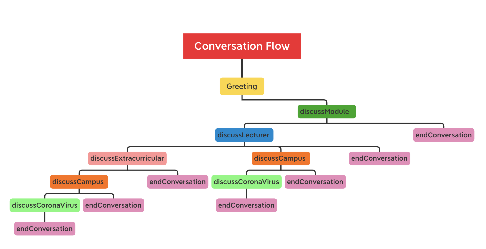

# Makoto-Bot

The chatbot was used to explore how personality affects the user's experience. 
Makoto was endowed with high agreeableness and high extroversion, and discussed topics associated with University life, specific to University College Dublin. 

Nasoto followed a conversation flow as described in the image below:

The implementation of each topic in the tree can be found in the Dialogs folder. 

## Run Makoto:

To begin the conversation click the link below, a white screen will appear. On the bottom of this screen there will be an input box that says ‘Type your message’ when you are ready to begin your conversation type anything into the input box and click enter to send the message. (It can take a few seconds to connect)

Your conversation with the chatbot will then begin, the conversation can take up to ten minutes.
Converse with the chatbot by answering its questions about your university experience.  
When you are finished conversing with the chatbot close the window. 

https://webchat.botframework.com/embed/Makoto-Bot/gemini?b=Makoto-Bot&s=oXxjPNNlraI.2Dbx8HD3aeLh76z5BqSml54lD2wWZPA3w38lkKGYuwk&username=test.name
